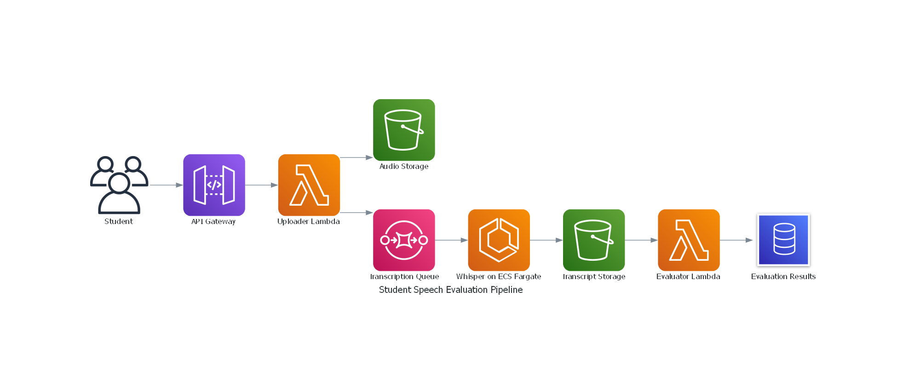

---

# 🗂️ Student Speech Evaluation Pipeline – Serverless Architecture Project

---

## 🚀 How to Run the Project

> **Tip**: It's recommended to create an ECR repository first.

### 🧪 Build & Push Docker Image

```bash
cd whisper-tiny-app
docker build -t whisper-tiny .
docker tag whisper-tiny <repo_url>/whisper-repo:vfinale
docker push <repo_url>/whisper-repo:vfinale
````

### ⚙️ Deploy Infrastructure with Terraform

```bash
terraform apply -var="image=<image-url>" --auto-approve

```
### ⚙️ use post man or curl (or invoke url for powershell)

```bash
Invoke-RestMethod -Method POST `
   -Uri <gateway_url>/upload `
   -ContentType "application/json" `
  -Body (Get-Content -Raw -Path "payload.json")

or : 

curl -X POST \
 <gateway_url>/upload \
  -H "Content-Type: application/json" \
  -d @payload.json

```


## 1. 🔍 Introduction

In this project, we developed a **serverless pipeline** to evaluate student speech recordings, transforming raw audio inputs into meaningful performance metrics. Students submit their recordings alongside metadata (student ID and original transcript), and the system processes this input to generate a transcript, calculate Words Per Minute (WPM), and compute Word Error Rate (WER).

We chose to implement a **serverless architecture** for this system due to its alignment with the event-driven nature of the workflow. Rather than managing infrastructure, we used managed AWS services that automatically scale, minimize cost, and simplify operations — allowing us to focus entirely on the evaluation logic and data flow.

---

## 2. ☁️ Why We Chose Serverless Architecture

We deliberately chose a serverless design for several reasons:

### ✅ 1. Event-Driven Design

Each step in the pipeline (e.g., audio upload, transcription, evaluation) is triggered by a discrete event — making it a perfect use case for AWS Lambda, S3 Event Notifications, and SQS.

### ✅ 2. Cost Efficiency

With serverless components like Lambda and Fargate, we only pay for actual usage, making it ideal for workloads with fluctuating or occasional activity.

### ✅ 3. Auto-Scaling

Serverless services automatically handle varying loads — from one student to hundreds — without manual scaling or over-provisioning.

### ✅ 4. Faster Development & Maintenance

Infrastructure concerns are abstracted away. This allows faster iteration and cleaner separation between components.

### ✅ 5. Fault Isolation and Resilience

Each function runs independently. Failures in one component (e.g., transcription) don't cascade across the system. Event queues buffer and retry messages.

---

## 3. ⚙️ System Pipeline Overview

Below is a step-by-step breakdown of how the system works:



---

### 🔹 Step 1: Student Input

* A frontend (web/app) sends:

  * `student_id`
  * `original_text`
  * `encoded_audio` (Base64)


  **Example Payload message:**
```json
{
    "id": "marry",
    "original_text": "But because she had to go to work, the only time she could do it was at 4:30 in the morning. But whenever I'd complained, my mother would just give me one of those looks, and she'd say, this is no picnic for me either.",
    "audio_base64": "AAAAGGZ0eXBtcDQyAAAAAG1wNDFpc29tAAAAKHV1aWRcpwj7Mo5CBahhZQ7KCpWWAAAADDEwLjAuMTkwNDUuMAAD6oFtZGF0A"
}
```

➡️ **API Gateway** receives this input and triggers the uploader Lambda function.


---

### 🔹 Step 2: Uploader Lambda

* Decodes the audio.
* Stores the audio file in an S3 bucket (`student-audio-bucket-demo`).
* Sends an SQS message with:

  * Audio file path
  * Student ID
  * Original text

**Example SQS message:**

```json
{
  "bucket": "student-audio-bucket-demo",
  "key": "Recording.m4a",
  "student_id": "student001"
}
```

---

### 🔹 Step 3: SQS Queue (Transcription Trigger)

* The message lands in an **SQS queue**, which decouples the Lambda from processing.
* Triggers an **ECS Fargate task** that runs Whisper.

---

### 🔹 Step 4: Whisper on ECS Fargate

* Pulls the audio from S3.

* Transcribes it using **Whisper**.

* Calculates:

  * Transcribed text
  * Audio duration
  * Word count
  * Words Per Minute (WPM)

* Uploads the result as a JSON file to another S3 bucket :
```json

{"student_id": "ayman",
"transcript": "I didn't, but because she had to go to work, the only time she could do it was at 430 in the morning. But whenever I'd complain, my mother would just give me one of those looks, and she'd say, this is no picnic for me, either. But...", 
"word_count": 48,
"duration_seconds": 11.61, 
"wpm": 248.16}
}
```


---

### 🔹 Step 5: S3 Event Notification

* The new transcription JSON triggers a second Lambda via S3 event.

---

### 🔹 Step 6: Evaluator Lambda

* Loads both:

  * Original text
  * Transcribed text
* Uses **jiwer** to calculate the **Word Error Rate (WER)**.
* Packages all results into a final JSON and stores it in a **DynamoDB** table.

**Example DynamoDB Record:**

```json
{
  "id": "ayman",
  "duration_seconds": 11.61,
  "original_text": "But because she had to go to work, ...",
  "transcribed_text": "I didn't, but because she had to go to work, ...",
  "wer_score": 0.1556,
  "wpm": 248.16,
  "word_count": 48,
  "total_score": 44.44,
  "uploaded_at": "2025-05-13T21:35:30.784147"
}
```

---

### 🔹 Step 7: DynamoDB

* Stores the evaluation results for later retrieval and analysis.
* Each entry is linked to the `student_id` and timestamped.

---

## 4. 🧩 Components Used

| Component          | Purpose                                          |
| ------------------ | ------------------------------------------------ |
| **API Gateway**    | Entry point for student submissions              |
| **Lambda**         | Handles upload, evaluation, and processing steps |
| **S3**             | Stores audio and transcription files             |
| **SQS**            | Decouples upload and processing workloads        |
| **ECS Fargate**    | Runs Whisper transcription engine                |
| **jiwer (Python)** | Calculates WER for accuracy scoring              |
| **DynamoDB**       | Stores final evaluation results                  |
| **CloudWatch**     | Logs and monitoring for observability            |

---

## 📘 Glossary – Key Terms Explained

<details>
<summary>🧠 Whisper</summary>

[Whisper](https://github.com/openai/whisper) is an open-source automatic speech recognition (ASR) system developed by OpenAI. It converts spoken audio into text using deep learning models trained on multilingual and multitask audio data.
</details>

<details>
<summary>📝 Word Error Rate (WER)</summary>

**WER** is a metric that measures the accuracy of a speech recognition system by comparing the transcribed text to the original reference.

**Formula:**

WER = (Substitutions + Deletions + Insertions) / Total Words in Reference


**Example:**  
If the original text has 20 words and 3 are incorrect (misheard, missing, or extra),  
then WER = 3 / 20 = **15%**
</details>

<details>
<summary>🚀 Words Per Minute (WPM)</summary>

**WPM** calculates how fast a person speaks. It helps assess reading fluency.

**Formula:**

WPM = Word Count / (Duration in Seconds ÷ 60)


**Example:**  
If a student reads 90 words in 30 seconds:  
WPM = 90 / (30 ÷ 60) = **180 WPM**
</details>


